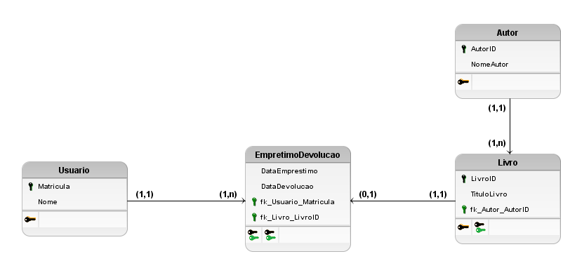

## Desafio 01
Você foi contratado para projetar um sistema de gerenciamento de uma biblioteca. Ela precisa de um sistema para rastrear os seus livros, autores, usuários, empréstimos e as suas devoluções.
Com base nisso, crie um Modelo Entidade-Relacionamento (MER) usando o BrModelo e identifique as entidades, os seus atributos e os seus relacionamentos. Alguns exemplos de entidades podem ser: Livro, Autor, Usuário, Empréstimo, Devolução etc. Crie os relacionamentos apropriados, como "Usuário faz Empréstimo" ou "Livro é escrito por Autor". Converta o MER em um Modelo Lógico, especificando os tipos de dados dos atributos e criando chaves primárias e estrangeiras.
Após isso, utilizando o MySQL Workbench, crie um Modelo Relacional com base no Modelo Lógico que você gerou no passo anterior. Elabore tabelas no banco de dados para representar as entidades e os relacionamentos, definindo os campos e suas restrições.
Ao terminar, envie o MER criado no BrModelo e o Modelo Relacional criado no MySQL Workbench.

### Resposta





````sql

create database biblioteca;

use biblioteca;

create table Usuario (
Matricula int primary key auto_increment,
Nome varchar(50) not null
);

create table Autor (
AutorID int primary key auto_increment,
NomeAutor varchar(50) not null
);

create table Livro (
LivroID int primary key auto_increment,
TituloLivro varchar (100) not null,
AutorID int not null,
foreign key(AutorID) references Autor(AutorID)
);

create table EmprestimoDevolucao (
DataRetirada date not null,
DataDevolucao date not null,
LivroID int not null,
foreign key(LivroID) references Livro(LivroID),
MatriculaUsuario int not null,
foreign key(MatriculaUsuario) references Usuario(Matricula)
);

````


