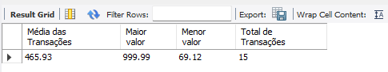

## Desafio 04

Você faz parte da equipe de análise de dados da TechData, uma empresa de tecnologia renomada. Ela coleta uma enorme quantidade de dados de seus produtos, usuários e transações. Recentemente, essa empresa decidiu aprimorar as suas habilidades de consulta de dados usando Data Query Language (DQL) para obter insights valiosos sobre o desempenho dos produtos, o comportamento do usuário e a eficácia das campanhas de marketing.
1. Seleção de dados: escreva uma consulta que selecione todos os dados de transações da tabela de transações;
2. Renomeando colunas: utilize a cláusula AS para renomear as colunas da consulta anterior para nomes mais descritivos, como ID_Transacao, Data, Valor etc.;
3. Filtragem com a cláusula WHERE: escreva uma consulta que selecione apenas as transações com um
valor superior a R$ 100,00
4. Ordenação com a cláusula ORDER BY: ordene as transações por valor em ordem decrescente;
5. Agregação com funções SQL: utilize funções SQL como AVG, MAX, MIN e COUNT para calcular a média, o valor máximo, o valor mínimo e o número total de transações;
6. Agrupamento com a cláusula GROUP BY: agrupe as transações por produto e calcule a média de valor para cada produto;
7. Consulta combinada: escreva uma consulta que selecione a quantidade total de produtos vendidos (COUNT), o valor total das vendas (SUM) e a média de valor por transação, agrupados por categoria de produto.
Entregáveis:
- Arquivo com as consultas DQL;
- Uma breve apresentação dos insights obtidos a partir dos resultados das consultas.

### Resposta

01  Consulta geral da tabela transações.


02 e 03 Alterar nomes das colunas para melhor leitura e compreenção da tabela.


04 Ordenar de forma decrescente, facilitando identificar as venda de maior para menor valor.


05 Trabalhar a tabela para obter médias, maximos, minimos e total das vendas



06 Agrupar por produto obtendo a média


07 Relatório com consulta combinada, agrupando por categoria.


Script SQL

````sql

create database VendasDB;

use VendasDB;

create table transacoes (
TransacaoID int primary key auto_increment ,
dataTransacao date not null,
ProdutoName varchar(50) not null,
categoryProduto varchar(45) not null,
ValueTransacao decimal(10,2) not null
);
insert into transacoes(dataTransacao, ProdutoName, categoryProduto, valueTransacao) values
( '2023-12-15', 'Agulhão Meca', 'Peixe marinho', 318.67),
('2023-12-20', 'camarão', 'frutos do mar',  550.37),
('2023-12-12', 'marisco', 'frutos do mar',  437.20),
('2023-12-15', 'Saramunete', 'Peixe marinho',  98.99),
('2023-12-20', 'tambaqui', 'Peixe rio',  750),
('2023-12-12', 'peito de frango', 'Aves',  87.98),
('2023-12-15', 'Pirarucu', 'Peixe rio',  897.35),
('2023-12-20', 'costelinha', 'Carne Suina',  93.82),
('2023-12-29', 'Bacon', 'Carne Suina',  99.99),
('2023-12-29', 'Picanha Suina', 'Carne Suina',  88.33),
('2023-12-12', 'Jaraqui', 'Peixe rio',  69.12),
('2023-12-23', 'Picanha', 'Carne bovina',  999.99),
('2023-12-6', 'Alcatra', 'Carne bovina',  869.44),
('2023-12-1', 'carre de cordeiro', 'Carne cordeiro', 850.31),
('2023-12-31', 'carre de cordeiro', 'Carne cordeiro', 777.33);

# Seleção de dados
select * from transacoes;

# Renomear Colunas / Filtro where
select 
TransacaoID as 'Cod Transação',
dataTransacao as 'Data da Transação',
produtoName as 'Produto',
categoryProduto as 'Categoria',
valueTransacao as 'Valor(R$)'
from transacoes
where valueTransacao > 100;


# Ordenar Order By
select 
TransacaoID as 'Cod Transação',
dataTransacao as 'Data da Transação',
produtoName as 'Produto',
categoryProduto as 'Categoria',
valueTransacao as 'Valor(R$)'
from transacoes
order by valueTransacao desc;

# Agregação
select
round(avg(valueTransacao),2) as 'Média das Transações',
max(valueTransacao) as 'Maior valor',
min(valueTransacao) as 'Menor valor',
count(*) as 'Total de Transações'
from transacoes;

# Agrupamento Group By
select
produtoName as 'Produto',
round(avg(valueTransacao),2) as 'Média Valor'
from transacoes
group by produtoName;

# Consulta combinada
select
categoryProduto as 'Categoria',
count(*) as 'Quantidade de produtos vendidos',
sum(valueTransacao) as 'Valor total da venda',
round(avg(valueTransacao),2) as 'Média por transação'
from transacoes
group by categoryProduto
order by count(categoryProduto) desc;

````
