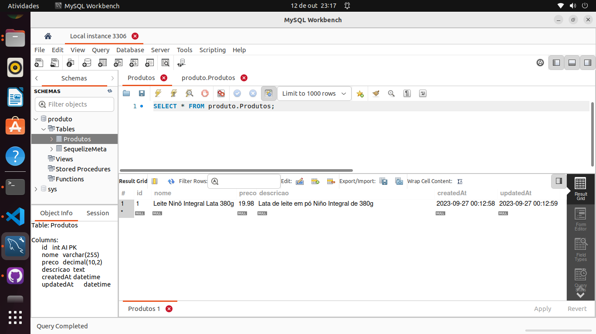

## Desafio 12 

Implemente e trate uma conexão com o seu banco de dados, usando JavaScript. Caso a conexão com o banco tenha sucesso, ele deve retornar uma frase positiva. Se isso não ocorrer, retorne uma frase informando o erro. 

