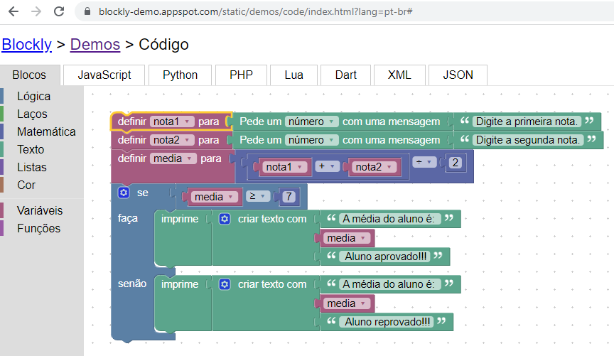

## Desafio 08

No hipertexto anterior, temos um exemplo de um fluxograma que realiza o cálculo da média de duas notas de um aluno. O fluxograma solicita duas notas que serão somadas, e logo em seguida a média dessas notas é calculada. Dessa forma o resultado da média quando é maior ou igual a 7 o aluno está APROVADO, quando menor que 7 o aluno está REPROVADO.

Utilizando o Google Blockly construa o algoritmos que realiza esse processamento.

### Resposta

https://blockly-demo.appspot.com/static/demos/code/index.html?lang=pt-br#ex7y6c



````js

var nota1, nota2, media;


nota1 = Number(window.prompt('Digite a primeira nota.'));
nota2 = Number(window.prompt('Digite a segunda nota.'));
media = (nota1 + nota2) / 2;
if (media >= 7) {
  window.alert(['A média do aluno é: ',media,' Aluno aprovado!!!'].join(''));
} else {
  window.alert(['A média do aluno é: ',media,' Aluno reprovado!!!'].join(''));
}

````
