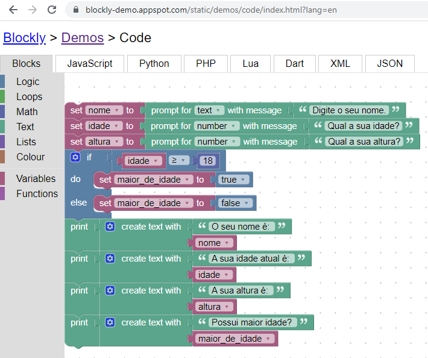

## Desafio 09

- Construa um algoritmo no Blockly que declare as seguintes variáveis: nome, idade, altura e maior_de_idade.

- Depois, atribua valores para essas variáveis, sabendo que a variável nome é uma string, a variável idade é um inteiro, a variável altura é um float e a variável maior_de_idade é um booleano.

- No final, imprima os valores das variáveis.

### resposta
https://blockly-demo.appspot.com/static/demos/code/index.html?lang=en#nzckko



````js
var nome, idade, altura, maior_de_idade;


nome = window.prompt('Digite o seu nome.');
idade = Number(window.prompt('Qual a sua idade?'));
altura = Number(window.prompt('Qual a sua altura?'));
if (idade >= 18) {
  maior_de_idade = true;
} else {
  maior_de_idade = false;
}
window.alert('O seu nome é: ' + String(nome));
window.alert('A sua idade atual é: ' + String(idade));
window.alert('A sua altura é: ' + String(altura));
window.alert('Possui maior idade? ' + String(maior_de_idade));


````
