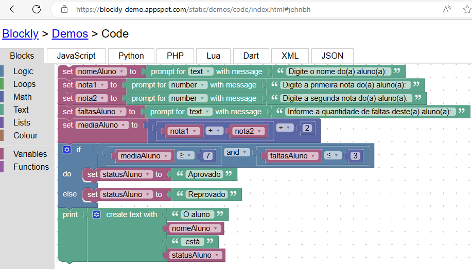

## Desafio 10

Desenvolva, utilizando o Google Blockly, um programa que utiliza o nome de um aluno, duas notas e a quantidade de faltas que ele teve. Conclua se o aluno está aprovado ou reprovado de acordo com as especificações:
 
- Se a média do aluno for menor que sete, o sistema deve informar o nome do aluno e que ele está reprovado;
- Se o aluno possuir mais de três faltas, o sistema deve informar o nome do aluno e que ele está reprovado;
- Se a média do aluno for maior ou igual a sete, o sistema deve informar o nome do aluno e que ele está aprovado.

No sistema, todos os valores devem estar armazenados em variáveis.

### Resposta

https://blockly-demo.appspot.com/static/demos/code/index.html#jehnbh



````

var nomeAluno, nota1, nota2, faltasAluno, mediaAluno, statusAluno;


nomeAluno = window.prompt('Digite o nome do(a) aluno(a): ');
nota1 = Number(window.prompt('Digite a primeira nota do(a) aluno(a): '));
nota2 = Number(window.prompt('Digite a segunda nota do(a) aluno(a): '));
faltasAluno = window.prompt('Informe a quantidade de faltas deste(a) aluno(a): ');
mediaAluno = (nota1 + nota2) / 2;
if (mediaAluno >= 7 && faltasAluno <= 3) {
  statusAluno = 'Aprovado';
} else {
  statusAluno = 'Reprovado';
}
window.alert(['O aluno ',nomeAluno,' está ',statusAluno].join(''));

````
