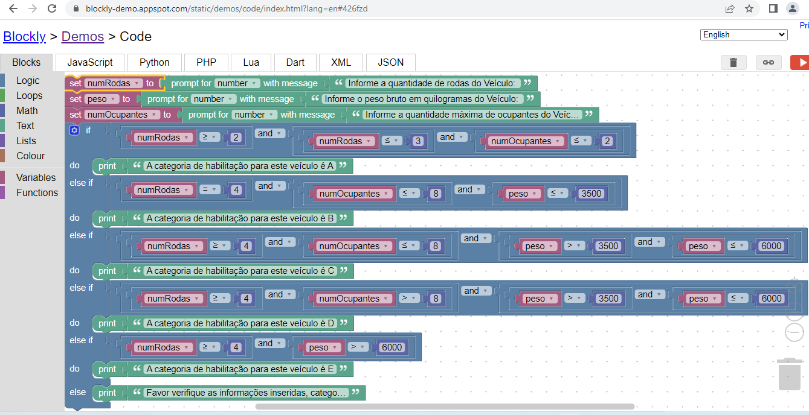

## Desafio 11

Desenvolva um código, utilizando o Google Blockly, que utilize as seguintes características de um veículo:
- Quantidade de rodas;
- Peso bruto em quilogramas;
- Quantidade de pessoas no veículo.

Com essas informações, o programa mostrará qual é a melhor categoria de habilitação para o veículo informado a partir das condições:
- A: Veículos com duas ou três rodas;
- B: Veículos com quatro rodas, que acomodam até oito pessoas e seu peso é de até 3500 kg;
- C: Veículos com quatro rodas ou mais e com peso entre 3500 e 6000 kg;
- D: Veículos com quatro rodas ou mais e que acomodam mais de oito pessoas;
- E: Veículos com quatro rodas ou mais e com mais de 6000 kg.


### Resposta

https://blockly-demo.appspot.com/static/demos/code/index.html?lang=en#426fzd



````js

var numRodas, peso, numOcupantes;


numRodas = Number(window.prompt('Informe a quantidade de rodas do Veículo: '));
peso = Number(window.prompt('Informe o peso bruto em quilogramas do Veículo: '));
numOcupantes = Number(window.prompt('Informe a quantidade máxima de ocupantes do Veículo: '));
if (numRodas >= 2 && numRodas <= 3 && numOcupantes <= 2) {
  window.alert('A categoria de habilitação para este veículo é A');
} else if (numRodas == 4 && numOcupantes <= 8 && peso <= 3500) {
  window.alert('A categoria de habilitação para este veículo é B');
} else if (numRodas >= 4 && numOcupantes <= 8 && peso > 3500 && peso <= 6000) {
  window.alert('A categoria de habilitação para este veículo é C');
} else if (numRodas >= 4 && numOcupantes > 8 && peso > 3500 && peso <= 6000) {
  window.alert('A categoria de habilitação para este veículo é D');
} else if (numRodas >= 4 && peso > 6000) {
  window.alert('A categoria de habilitação para este veículo é E');
} else {
  window.alert('Favor verifique as informações inseridas, categoria não encontrada.');

````
