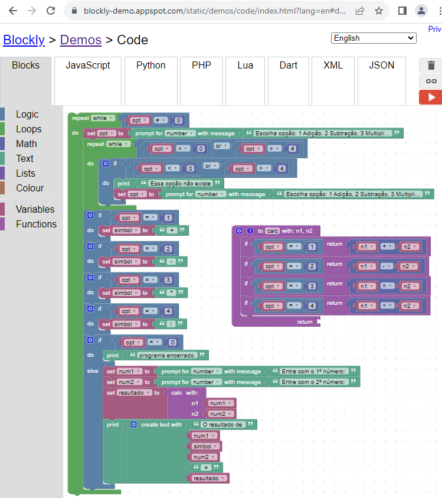

## Desafio 14

Faça, utilizando o Google Blockly, uma função calculadora que os números e as operações serão feitas pelo usuário. O código deve ficar rodando infinitamente até que o usuário escolha a opção de sair. No início, o programa mostrará a seguinte lista de operações:
1: Soma
2: Subtração
3: Multiplicação
4: Divisão
0: Sair

Digite o número para a operação correspondente e caso o usuário introduza qualquer outro, o sistema deve mostrar a mensagem “Essa opção não existe” e voltar ao menu de opções.

Após a seleção, o sistema deve pedir para o usuário inserir o primeiro e segundo valor, um de cada. Depois precisa executar a operação e mostrar o resultado na tela. Quando o usuário escolher a opção “Sair”, o sistema irá parar. 

É necessário que o sistema mostre as opções sempre que finalizar uma operação e mostrar o resultado. 

### Resposta

https://blockly-demo.appspot.com/static/demos/code/index.html?lang=en#dn8kaf



````js

var n1, n2, opt, simbol, num1, num2, resultado;

// Descreva esta função...
function calc(n1, n2) {
  if (opt == 1) {
    return n1 + n2;
  }
  if (opt == 2) {
    return n1 - n2;
  }
  if (opt == 3) {
    return n1 * n2;
  }
  if (opt == 4) {
    return n1 / n2;
  }
}


while (opt != 0) {
  opt = Number(window.prompt('Escolha opção: 1 Adição, 2 Subtração, 3 Multiplicação, 4 Divisão e 0 Sair'));
  while (opt < 0 || opt > 4) {
    if (opt < 0 || opt > 4) {
      window.alert('Essa opção não existe');
      opt = Number(window.prompt('Escolha opção: 1 Adição, 2 Subtração, 3 Multiplicação, 4 Divisão e 0 Sair'));
    }
  }
  if (opt == 1) {
    simbol = ' + ';
  }
  if (opt == 2) {
    simbol = ' - ';
  }
  if (opt == 3) {
    simbol = ' * ';
  }
  if (opt == 4) {
    simbol = ' / ';
  }
  if (opt == 0) {
    window.alert('programa encerrado.');
  } else {
    num1 = Number(window.prompt('Entre com o 1º número: '));
    num2 = Number(window.prompt('Entre com o 2º número: '));
    resultado = calc(num1, num2);
    window.alert(['O resultado de ',num1,simbol,num2,' = ',resultado].join(''));
  }
}

````
